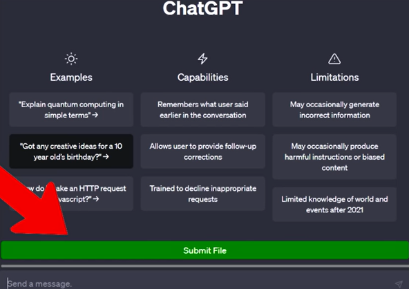
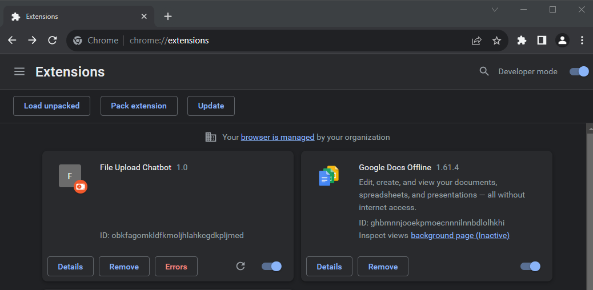

# ChatGPTFileuploadChromeExtension

This extension will place a file upload for you on the ChatGPT website. Allow you to process your own scripts, files, documents, code, database and more in chat. Allow ChatGPT to work with your own data, answering questions, giving suggestions and updating the file. Full Props goes to  "Automate My Life" on Youtube, for the great code.

1. Clone this repository.
2. Open Chrome and click the extensions button (Puzzle piece).
3. Toggle Developer mode.
4. Click Load unpacked.
5. Select the repository folder.
6. Ignore the error (false positive)
7. Go to the ChatGPT website, you will now have a File upload Button.
8. The loading indicator shows how much has been uploaded as the script breaks the file into chunks to stay within the character limits of ChatGPT.

